## EM算法

[NLP-机器学习笔试面试题解析]Github链接(https://github.com/WerterHong/Machine-Learning-Algorithm-NLP/tree/master/机器学习算法/)

[EM算法-有道云笔记](http://note.youdao.com/noteshare?id=84052b8032023304deb8f159ed529fcd&sub=D022D38477F9432C9D1FD623324304ED)

### 1. EM算法简介

在[极大似然估计](https://github.com/WerterHong/Machine-Learning-Algorithm-NLP/tree/master/机器学习算法/极大似然估计.md)中，两枚硬币`A`和`B`正面的概率已经通过最大化似然函数得到。如果**抽取得到的硬币不知道是`A`还是`B`(隐性变量)**？即存在两个参数变量：一是抽取的硬币是`A`还是`B`？二是硬币抛出正面的概率是多少？

最大期望（EM）算法是在概率模型中寻找**参数最大似然估计**或者**最大后验估计**的算法，其中概率模型**依赖于**无法观测的**隐性变量**。

最大期望算法图：

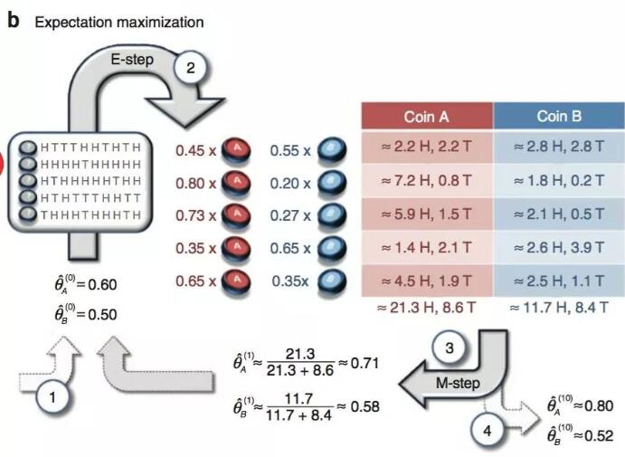

### 2. EM算法推导

假设样本集`$\{x^{(1)},..., x^{(m)}\}$`包含`m`个独立样本，找每个样本隐含的类别`z`(隐性变量)使得概率模型`p(x,z)`最大，`p(x,z)`的最大似然估计如下：

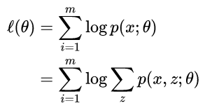

第一步是对极大似然取对数，第二步是对每个样例的每个可能类别`z`求联合分布概率和。因隐含变量`z`存在，不能直接最大化`ℓ(θ)`
，通过不断地建立`ℓ`的下界(E步)，然后优化下界(M步)。

对于每一个样例`i`，让`$Q_i$`表示该样例隐含变量`z`的某种分布(如果`z`是连续性的，那`$Q_i$`是概率密度函数，需要将求和符号换做积分符号)，`$Q_i$`满足的条件是[式(1)]

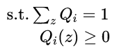

变换得：

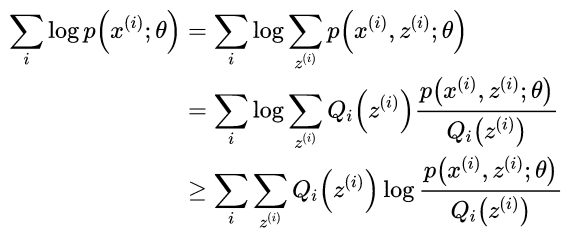

其中

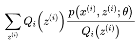

就是

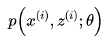

的期望。

这个过程可以看作对`ℓ(θ)`求了下界。通过调整概率`$Q_{i}(z^{(i)})$`和`$p(x^{(i)},z^{(i)})$`使下界不断上升，以逼近`ℓ(θ)`的真实值。当不等式变成等式时，说明我们调整后的概率能够等价于`ℓ(θ)`了。令

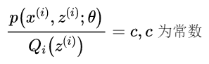

因为式(1)，则

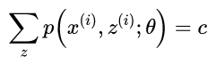

于是有：

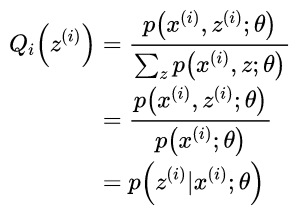

在固定其他参数`θ`后，`$Q_{i}(z^{(i)})$`的计算公式就是后验概率，解决了`$Q_{i}(z^{(i)})$`如何选择的问题。这一步就是E步，建立`ℓ(θ)`的下界。接下来的M步，就是在给定`$Q_{i}(z^{(i)})$`后，调整`θ`，去极大化`ℓ(θ)`的下界（在固定`$Q_{i}(z^{(i)})$`后，下界还可以调整的更大）。

### 3. EM算法流程

初始化分布参数`θ`； 重复`E`、`M`步骤直到收敛：

> **(E 步骤)** 根据参数`θ`初始值或上一次迭代所得参数值来计算出隐性变量的后验概率（即隐性变量的期望），作为隐性变量的现估计值：

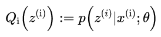

> **(M 步骤)** 将似然函数最大化以获得新的参数值:

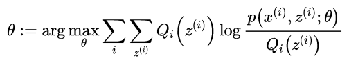

### Q1：隐性变量估计问题可以使用梯度下降等优化算法求解？
可以，但是存在一定的缺陷：
- 由于**求和的项数将随着隐性变量的数目以指数级上升**，会给梯度计算带来麻烦。

EM算法可以看作是一种非梯度优化方法。事实上，可以看作用**坐标下降**（coordinate descent）法来最大化对数似然下界的过程。

### Q2：隐性变量估计和聚类联系

如果将样本看作观察值，潜在类别看作是隐性变量，那么聚类问题也就是参数估计问题，只不过聚类问题中参数分为隐含类别变量和其他参数。这犹如在x-y坐标系中找一个曲线的极值，然而曲线函数不能直接求导，因此什么梯度下降方法就不适用了。

但固定一个变量后，另外一个可以通过求导得到，因此可以使用坐标上升法，一次固定一个变量，对另外的求极值，最后逐步逼近极值。对应到EM上，E步估计隐含变量，M步估计其他参数，交替将极值推向最大。

### Q3：用EM算法推导解释Kmeans

`k-means`是两个步骤交替进行：确定中心点，对每个样本选择最近中心点–> E步和M步。

> E步中将每个点选择最近的类优化目标函数，分给中心距它最近的类(硬分配)，可以看成是EM算法中E步(软分配)的近似。
>
> M步中更新每个类的中心点，可以认为是在「各类分布均为单位方差的高斯分布」的假设下，最大化似然值。

实际上``k-means``是**hard EM**算法， 而普通上一般说的EM算法是**soft EM**。所谓**hard就是0-1二分抉择**（即硬币要么全是硬币`A`要么全是`B`）。 而``soft``是一个概率，从这里可以再次看出为什么`EM`用于隐变量说明隐变量是服从某种存在的分布（**隐分布**）的。
