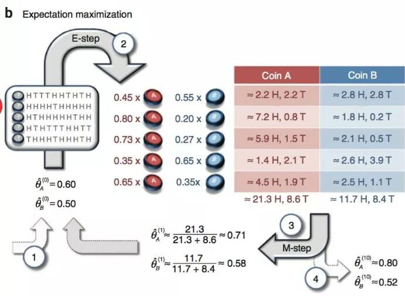

## EM算法

[NLP-机器学习笔试面试题解析]Github链接(https://github.com/WerterHong/Machine-Learning-Algorithm-NLP/tree/master/机器学习算法/)

### EM算法简介

现在就存在一个隐性变量：抽取得到的硬币不知道是`A`还是`B`。
在[极大似然估计](https://github.com/WerterHong/Machine-Learning-Algorithm-NLP/tree/master/机器学习算法/极大似然估计.md)中，两枚硬币`A`和`B`正面的概率已经通过最大化似然函数得到。如果**抽取得到的硬币不知道是`A`还是`B`(隐性变量)**？即存在两个参数变量：一是抽取的硬币是`A`还是`B`？二是硬币抛出正面的概率是多少？

最大期望（EM）算法是在概率模型中寻找**参数最大似然估计**或者**最大后验估计**的算法，其中概率模型**依赖于**无法观测的**隐性变量**。

最大期望算法图：
<p align="center">

</p>

### EM算法推导

```math
\begin{array}{}
\left\{x^{(1)}, \ldots, x^{(m)}\right\}
\end{array}
```
