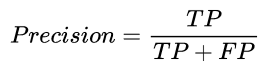
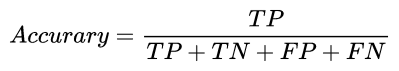
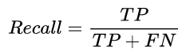
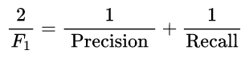
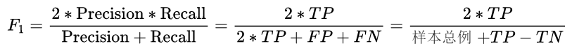

## 精确率(precision)和召回率(recall)

- NLP-机器学习笔试面试题解析 [Github链接](https://github.com/WerterHong/Machine-Learning-Algorithm-NLP/tree/master/机器学习算法/)
- **Precision/Recall/F1** (若公式显示错误，请点击此链接) [有道云笔记](http://note.youdao.com/noteshare?id=eb84a293592d2639dab29e205fdd3895&sub=B21FA6BC931C4836A9D3EA0E6DABAAF6)

混淆矩阵

- True Positive(真正例, TP)：将正类预测为正类数.
- False Negative(假负例, FN)：将正类预测为负类数 → 漏报 (Type II error).
- False Positive(假正例, FP)：将负类预测为正类数 → 误报 (Type I error).
- True Negative(真反例, TN)：将负类预测为负类数.

<table>
  <tr>
    <th rowspan="2"> 真实情况</th>
    <th colspan="2">预测结果</th>
  </tr>
  <tr>
    <td>正例 Positive</td>
    <td>反例 Negative</td>
  </tr>
  <tr>
    <td>正例 True</td>
    <td>True Positive (TP)</td>
    <td>True Negative (TN)</td>
  </tr>
  <tr>
    <td>反例 False</td>
    <td>False Positive (FP)</td>
    <td>False Negative (FN)</td>
  </tr>
</table>

**精确率**(precision)定义为：

需要注意的是精确率(precision)和准确率(accuracy)是不一样的，

其中`TP+TN+FP+FN=样本总例`。

在正负样本不平衡的情况下，准确率这个评价指标有很大的缺陷。比如在互联网广告里面，点击的数量是很少的，一般只有千分之几，如果用acc，即使全部预测成负类（不点击）acc 也有 99% 以上，没有意义。

**召回率**(recall, sensitivity, true positive rate)定义为：

此外，还有`F1`值，是**精确率和召回率的调和均值**，

精确率和准确率都高的情况下，`F1`值也会高。
