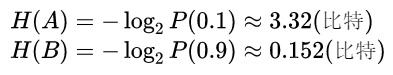
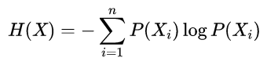
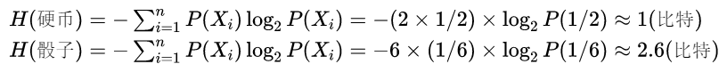
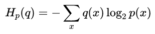
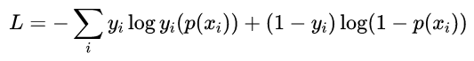
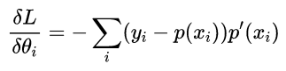
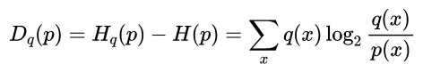

## 信息熵[投掷筛子]

- NLP-机器学习笔试面试题解析 [Github链接](https://github.com/WerterHong/Machine-Learning-Algorithm-NLP/tree/master/机器学习算法/)

[信息熵/交叉熵/KL散度-有道云笔记](http://note.youdao.com/noteshare?id=3e095525a3d4c58a43349b1f346b5a8f&sub=48B3B98D1C4E4477A34CDEBEC2992866)

### 1. 信息熵

如何计算信息量的多少？在日常生活中，极少发生的事件一旦发生是容易引起人们关注的，而司空见惯的事不会引起注意，也就是说，极少见的事件所带来的信息量多。如果用统计学的术语来描述，就是出现概率小的事件信息量多。因此，**事件出现得概率越小，信息量愈大**。即**信息量的多少是与事件发生频繁(即概率大小)成反比**。

- 如已知事件`$Xi$`已发生，则表示`$Xi$`所含有或所提供的信息量

　　**例题**：若估计在一次国际象棋比赛中谢军获得冠军的可能性为0.1(记为事件A)，而在另一次国际象棋比赛中她得到冠军的可能性为0.9(记为事件B)。试分别计算当你得知她获得冠军时，从这两个事件中获得的信息量各为多少？

- 统计信息量的计算公式为：

`$X_i$` —— 表示第`i`个状态(总共有n种状态)；

`$P(X_i)$` —— 表示第`i`个状态出现的概率；

`$H(X)$` ——表示用以消除这个事物的不确定性所需要的信息量。

　　**例题**：向空中投掷硬币，落地后有两种可能的状态，一个是正面朝上，另一个是反面朝上，每个状态出现的概率为1/2。如投掷均匀的正六面体的骰子，则可能会出现的状态有6个，每一个状态出现的概率均为1/6。试通过计算来比较状态的不肯定性与硬币状态的不肯定性的大小。
　　

> 由以上计算可以得出两个推论：
>
> [**推论1**] 当且仅当某个`$P(X_i)=1$`，其余的都等于0时， H(X)= 0。
>
> [**推论2**]当且仅当某个`$P(X_i)=1/n$`，`i=1,2,...,n`时，`H(X)`有极大值`log(n)`。数值属性是可度量的量，用整数或实数值表示，有区间标度和比率标度两种类型。

### 2. 交叉熵 cross-entropy

交叉熵本质上可以看成，用一个猜测的分布的编码方式去编码其真实的分布,得到的平均编码长度或者信息量:

如上面的式子,用猜的的`p`分布,去编码原本真实为`q`的分布,得到的信息量。

#### - cross-entropy在机器学习领域的作用

交叉熵cross-entropy在机器学习领域中经常作为最后的损失函数。

为什么要用**cross-entropy**呢，**它本质上相当于衡量两个编码方式之间的差值，因为只有当猜测的分布约接近于真实分布，则其值越小**。

比如根据自己模型得到的`A`的概率是80%，得到`B`的概率是20%，真实的分布是应该得到`A`，则意味着得到A的概率是100%，所以:

在LR中用cross-entry比平方误差方法好在：
- 在LR中，如果用平方损失函数，则损失函数是一个非凸的，而用cross-entropy的话就是一个凸函数
- 用cross-entropy做LR求导的话，得到的导数公式如下:

而用平方损失函数的话，其求导结果为:

平方损失函数中会出现`$p^,(x_i)$`，而sigmoid函数的导数会出现梯度消失的问题【一些人称之为饱和现象】

### 3. KL散度

KL散度/距离是衡量两个分布的距离,KL距离一般用`D(q||p)`或者`$D_q(p)$`称之为q对p的相对熵。

用图像形象化的表示KL散度、信息熵以及交叉熵之间的关系可以如下图：

- 第一行是`q`所含的信息量/平均编码长度（即信息熵）`H(p) `
- 第二行是cross-entropy，即用`q`来编码`p`所含的信息量/平均编码长度或者称之为`q`对`p`的交叉熵
- 第三行是上面两者之间的差值即为`q`对`p`的`KL`散度/距离
