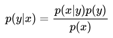
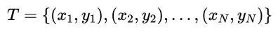
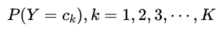
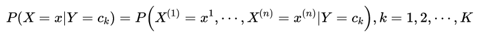
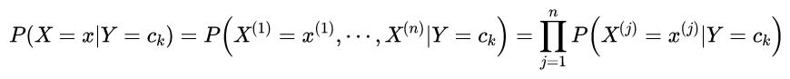
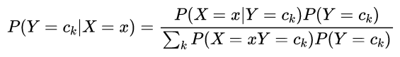
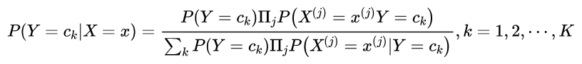
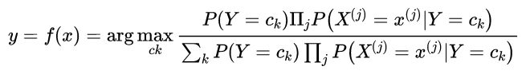
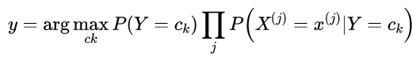

## 朴素贝叶斯

- NLP-机器学习笔试面试题解析 [Github链接](https://github.com/WerterHong/Machine-Learning-Algorithm-NLP/tree/master/NLP算法/)
- **朴素贝叶斯** [有道云笔记](http://note.youdao.com/noteshare?id=0693c471d86002cc0bae2403a96e6632&sub=B89A3590BCC74A21BAA0183AE3418CDD)

朴素贝叶斯（Naïve Bayes）法是基于**贝叶斯定理**与**特征条件独立假设**的分类方法。
> 朴素：特征条件独立
>
> 贝叶斯：基于贝叶斯定理

贝叶斯定理：

朴素贝叶斯法实际上学习到生成数据的机制，因为其学习的是一个**联合概率分布**，所以属于**生成模型**。

### 1. 朴素贝叶斯法

假设输入空间`$\mathcal{X} \subseteq R^{n}$`为`n`维向量的集合，输出空间为类标记的集合`$\mathcal{Y} \subseteq\left\{c_{1}, c_{2}, \cdots, c_{K}\right\}$`.输入特征向量`$x \in \mathcal{X}$`,输出类标记`$y \in \mathcal{Y}$`.`X`是定义在输出空间`$\mathcal{X}$`上的随机变量，`Y`是定义在输出空间`$\mathcal{Y}$`上的随机变量.`P(X,Y)`是`X`和`Y`上的联合概率分布。训练数据集为

由`P(X,Y)`独立同分布产生。

朴素贝叶斯法通过训练数据集学习联合概率分布`P(X,Y)`。
- 学习先验概率分布以及条件概率分布,得到联合概率分布`P(X,Y)`
> 先验概率分布

> 条件概率分布

> - 条件概率分布有**指数级数量的参数**，其估计实际是不可行的.

朴素贝叶斯法对条件概率分布做了**条件独立性假设**。假设**用于分类的特征在类稳定的条件下都是条件独立的**，模型包含的条件概率的数量大大减少，学习与预测大为简化，但是会损失准确率。条件独立性假设是[式(1.1)]：

朴素贝叶斯方法在分类时，对给定的输入`x`, 通过学习到的模型计算后验概率分`$P(Y=c_k|X=x)$` 将后验概率最大的类作为`x`类的输出，后验概率计算可以依据贝叶斯定理进行[式(1.2)]：

将式(1.1)代入式(1.2)式，得到：

式(1.3)是朴素贝叶斯分类的基本公式。朴素贝叶斯分类器可表示为：

简化得到最终的**贝叶斯分类器的决策函数**为：

#### 后验概率最大化

详情见《统计学习方法》4.1.2  P48 以及《机器学习》

### 2. 参数估计(极大似然函数)

[详情见极大似然估计](https://github.com/WerterHong/Machine-Learning-Algorithm-NLP/tree/master/机器学习算法/极大似然估计.md)
