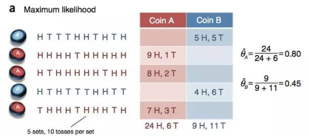

## 极大似然估计 MLE

- NLP-机器学习笔试面试题解析 [Github链接](https://github.com/WerterHong/Machine-Learning-Algorithm-NLP/tree/master/机器学习算法/)

极大似然估计(`Maximum Likelihood Estimation`，简称`MLE`)

### 求解过程
求最大似然函数估计值的一般**步骤**：
1. 写出似然函数；
2. 对似然函数取对数，并整理；
3. 求导数，令导数为0，得到似然方程；
4. 解似然方程，得到的参数即为所求；
