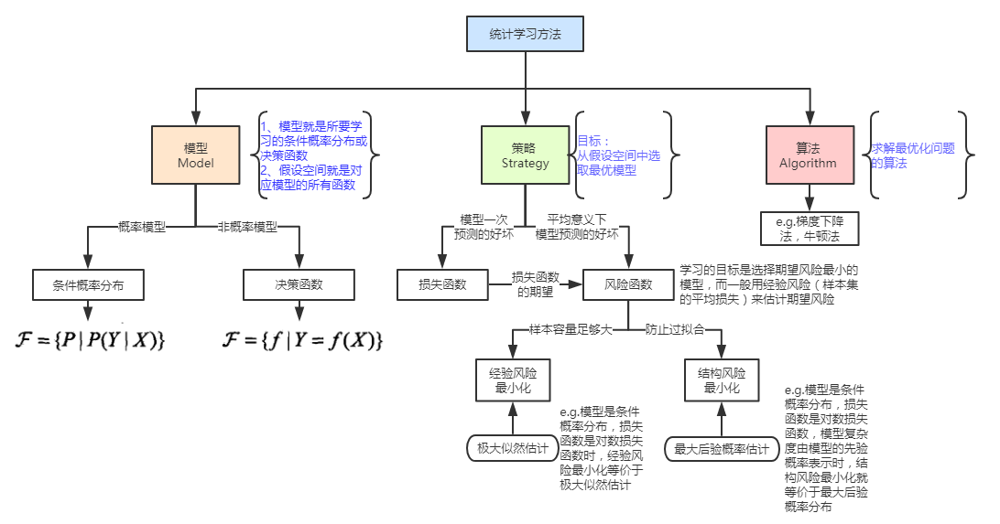
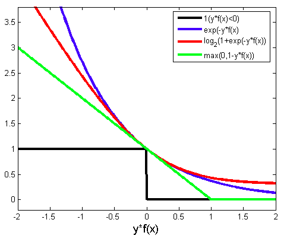

## 统计学习方法总结

[NLP-机器学习笔试面试题解析]Github链接(https://github.com/WerterHong/Machine-Learning-Algorithm-NLP/tree/master/机器学习算法/)

[统计学习方法总结-有道云笔记](http://note.youdao.com/noteshare?id=27acc01d9c26db945952f78c451bf946&sub=BCE3B26668334DAC84825F3CDCC9F2B7)

<strong>10种统计学习方法特点概括总结</strong>

|      方法      |     适用问题     |                      模型特点                      | 模型类型 |              学习策略              |    学习的损失函数    |                学习算法                | Github                                                                                                             |
|:--------------:|:----------------:|:--------------------------------------------------:|:--------:|:----------------------------------:|:--------------------:|:--------------------------------------:|--------------------------------------------------------------------------------------------------------------------|
|     感知机     |      二分类      |                     分离超平面                     | 判别模型 |     极小化误分点到超平面的距离     | 误分点到超平面的距离 |              随机梯度下降              |                                                                                                                    |
|     `k`近邻    |   多类分类,回归  |                   特征空间,样本点                  | 判别模型 |                                    |                      |                                        |                                                                                                                    |
|   朴素贝叶斯   |     多类分类     |        特征与类别的联合概率分布,条件独立假设       | 生成模型 |    极大似然估计,极大后验概率估计   |     对数似然损失     |          概率计算公式,`EM`算法         | [Link](https://github.com/WerterHong/Machine-Learning-Algorithm-NLP/tree/master/机器学习算法/朴素贝叶斯.md)        |
|     决策树     |   多类分类,回归  |                    分类树,回归树                   | 判别模型 |        正则化的极大似然估计        |     对数似然损失     |         特征选择,树生成,树剪枝         | [Link](https://github.com/WerterHong/Machine-Learning-Algorithm-NLP/tree/master/机器学习算法/决策树.md)            |
|  逻辑斯谛回归  |     多类分类     |      特征条件下类别的条件概率分布,对数线性模型     | 判别模型 |  极大似然估计,正则化的极大似然估计 |     逻辑斯谛损失     |  改进的迭代尺度算法,梯度下降，拟牛顿法 | [Link](https://github.com/WerterHong/Machine-Learning-Algorithm-NLP/tree/master/机器学习算法/逻辑回归LR.md)        |
|   支持向量机   |      二分类      |                 分离超平面，核技巧                 | 判别模型 | 极小化正则化合页损失，软间隔最大化 |       合页损失       |         序列最小最优化算法(SMO)        | [Link](https://github.com/WerterHong/Machine-Learning-Algorithm-NLP/tree/master/机器学习算法/支持向量机SVM.md)     |
|    提升方法    |      二分类      |                 弱分类器的线性组合                 | 判别模型 |      极小化加法模型的指数损失      |       指数损失       |            前向分布加法算法            |                                                                                                                    |
|    `EM`算法    | 概率模型参数估计 |                  含隐变量概率模型                  |          |    极大似然估计,极大后验概率估计   |     对数似然损失     |                迭代算法                | [Link](https://github.com/WerterHong/Machine-Learning-Algorithm-NLP/tree/master/机器学习算法/EM算法.md)            |
| 隐马尔科夫模型 |       标注       |        观测序列与状态序列的联合概率分布模型        | 生成模型 |    极大似然估计,极大后验概率估计   |     对数似然损失     |          概率计算公式,`EM`算法         | [Link](https://github.com/WerterHong/Machine-Learning-Algorithm-NLP/tree/master/机器学习算法/隐马尔科夫模型HMM.md) |
|   条件随机场   |       标注       | 状态序列条件下观测序列的条件概率模型，对数线性模型 | 判别模型 |  极大似然估计,正则化的极大似然估计 |     对数似然损失     | 改进的迭代尺度算法，梯度下降，拟牛顿法 | [Link](https://github.com/WerterHong/Machine-Learning-Algorithm-NLP/tree/master/机器学习算法/条件随机场.md)        |

### 统计学习三要素：**模型**、**策略**、**算法**

输入空间或者特征空间与输出空间之间所有可能的映射情况成为假设空间，而映射之所以存在是因为统计学习**假设**输入值与输出值是**根据联合概率密度`P(X,Y)`独立同分布产生的**。而**模型**就是假设空间中的一种特殊情况，当然假设空间中的模型有无数种。

策略**就是一种在无限的模型当中找出一种符合当前数据分布的模型的方法，目标是从假设空间中寻找出最优模型**。通过定义**损失函数**或者**代价函数**来达到这一目的。损失函数是模型预测值`f(X)`和真值`Y`的非负实值函数`L(f(X), Y)`。

Fig. 统计学习概述

Fig. 0-1损失函数、指数损失函数、逻辑斯蒂损失函数、合页损失函数的关系

