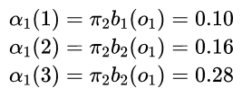
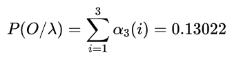
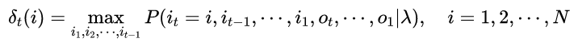

## 隐马尔科夫模型 HMM

[NLP-机器学习笔试面试题解析]Github链接(https://github.com/WerterHong/Machine-Learning-Algorithm-NLP/tree/master/机器学习算法/)

### 1. 隐马尔科夫模型简述

隐马尔科夫模型(`hidden Markov model, HMM`)是关于时序的概率模型，描述由一个**隐藏的马尔可夫链**随机生成**不可观测状态随机序列**，再由各个状态生成一个观测而产生**观测随机序列**的过程。

`HMM`是一个**生成模型**表示状态序列和观测序列的联合分布，但是状态序列是隐藏的，不可观测的。

> 隐马尔科夫模型`HMM`由**初始状态概率向量**`$\pi$`、**状态转移概率矩阵**`A`以及**观测概率矩阵**`B`确定。`$\lambda =(A,B,\pi)$`

设`Q`是所有可能状态的集合，`V`是对应的观测序列，即：
```math
Q=\left\{q_{1}, q_{2}, \ldots, q_{N}\right\} \quad V=\left\{v_{1}, v_{2}, \ldots, v_{M}\right\}
```
其中，`N`是可能的状态数，`M`是可能观测的数。另外设`I`是长度为`T`的状态序列，`O`是对应的观测序列：
```math
I=\left\{i_{1}, i_{2}, \ldots, i_{T}\right\} \quad O=\left\{o_{1}, o_{2}, \ldots, o_{T}\right\}
```
**状态转移概率矩阵**`A`为：
```math
A=\left[a_{i j}\right]_{N \times N}
```
其中,
```math
{a_{i j}=p\left(i_{t+1}=q_{j} | i_{t}=q_{i}\right)}, \quad{i=1,2, \ldots, N; j=1,2, \ldots, N}
```
是在时刻`t`处于状态`$q_i$`的条件下在`t+1`转移到状态`$q_j$`的概率。

**观测概率矩阵**`B`为：
```math
B=\left[b_{j}(k)\right]_{N \times M}
```
其中，
```math
b_{j}(k)=P\left(o_{t}=v_{k} | i_{t}=q_{j}\right), \quad{k=1,2, \ldots, M; j=1,2, \ldots, N}
```
是在时刻`t`处于状态`$q_i$`的条件下生成观测`$v_k$`的概率。

**初始状态概率向量**`$\pi$`为：
```math
\pi=(\pi_i)
```
其中，
```math
\pi_i=P(i_1=q_i), \quad i=1,2, \ldots ,N
```
是时刻`t=1`处于状态`$q_i$`的概率。

- ##### 隐马尔科夫模型基本假设：
1. **齐次马尔可夫性假设**，即假设隐藏的马尔可夫链在任意时刻`t`的状态只依赖于前一刻的状态，与其他时刻的状态及观测无关，也与时刻`t`无关。
```math
p\left(i_{t} | i_{t-1}, o_{i-1}, \ldots, i_{1}, o_{1}\right)=p\left(i_{t} | i_{t-1}\right), t=1,2, \ldots, T
```
2. **观测独立性假设**，即假设任意时刻的观测只依赖于该时刻的马尔可夫链的状态，与其他观测及状态无关。
```math
p\left(o_{t} | i_{T}, o_{T}, i_{T-1}, o_{T-1}, \ldots i_{t+1}, o_{t+1}, i_{t}, o_{t}, \ldots, i_{1}, o_{1}\right)=p\left(o_{t} | i_{t}\right)
```


##### > 举个栗子 <

（**盒子和球模型**）假设有4个盒子，每个盒子里都装有红白两种颜色的球，盒子里的红白球数由下表给出：
<p align="center">
<table>
  <tr>
    <th>盒子</th>
    <th>1</th>
    <th>2</th>
    <th>3</th>
    <th>4</th>
  </tr>
  <tr>
    <td>红球数</td>
    <td>5</td>
    <td>3</td>
    <td>6</td>
    <td>8</td>
  </tr>
  <tr>
    <td>白球数</td>
    <td>5</td>
    <td>7</td>
    <td>4</td>
    <td>2</td>
  </tr>
</table>
</p>

抽球方式：开始，从4个盒子里以等概率随机选取1个盒子，从这个盒子随机抽出1个球，记录其颜色后，放回；然后，从当前盒子随即转移到下个盒子，转移规则如下(即状态转移矩阵`A`)：
```math
A=\left [ \begin{matrix}
0 & 1 & 0 & 1 \\ 
0.4 & 0 & 0.6 & 0 \\ 
0 & 0.4 & 0 & 0.6 \\ 
0 & 0 & 0.5 & 0.5
\end{matrix} \right ]
```
确定转移的盒子后，再从这个盒子里随机抽出1个球，记录其颜色，放回；如此重复5次，得到一个球的颜色的观测序列为：
```math
O=\{红,红,白,白,红\}
```
> 两个随机序列：盒子的序列（状态序列）、球的颜色的序列（观测序列）。前者式隐藏的，只有后者是可以观测的。可以明确：状态集合、观测集合以及模型的三要素。

盒子对应状态，状态的集合是
```math
Q=\{盒子1,盒子2,盒子3,盒子4\}, N=4
```
球的颜色对应观测，观测的集合是
```math
V=\{红,白\}, V=2
```
状态序列和观测序列长度`T=5`。初始概率分布为
```math
\pi=(0.25,0.25,0.25,0.25)^T
```
观测概率分布为
```math
B=\left [ \begin{matrix}
0.5 & 0.5 \\ 
0.3 & 0.7 \\ 
0.6 & 0.4 \\ 
0.8 & 0.2
\end{matrix} \right ]
```
#### 观测序列的生成过程

输入：隐马尔科夫模型`$\lambda =(A,B,\pi)$`，观测序列长度`T`；

输出：观测序列`$O=\left\{o_{1}, o_{2}, \ldots, o_{T}\right\}$`。

1. 按照初始状态分布`$\pi$`产生状态`$i_1$`
2. 令`t=1`
3. 按照状态`$i_t$`的观测概率分布`$b_{i_t}(k)$`生成`$o_t$`
4. 按照状态`$i_t$`的状态转移概率分布`$\{a_{i_ti_{t+1}}\}$`产生状态`$i_{t+1}, i_{t+1}=1,2,...,N$`
5. 令`t=t+1`；如果`t<T`，转步(3)；否则，终止

### 2. 概率计算

#### 前向-后向算法

##### >举个栗子<

(**前向算法**)考虑盒子和球模型`$\lambda =(A,B,\pi)$`，状态集合`Q={1,2,3}`，观测集合`V={红,白}`，
```math
A=\left [ \begin{matrix}
0.5 & 0.2 & 0.3 \\ 
0.3 & 0.5 & 0.2 \\ 
0.2 & 0.3 & 0.5 
\end{matrix} \right ]
，
B=\left [ \begin{matrix}
0.5 & 0.5 \\ 
0.4 & 0.6 \\ 
0.7 & 0.3  
\end{matrix} \right ]
，
\pi=(0.2,0.2,0.4)^T
```
设`T=3`，`O={红,白,红}`，试用前向算法计算`$P(O/\lambda)$`。

**解**

(1) 计算初值
<p align="center">

</p>
(2) 递推计算
<p align="center">

</p>
(3) 终止
<p align="center">

</p>
### 3. 预测算法

#### Viterbi 算法

**维特比算法**是用**动态规划**求概率最大路径（最优路径），一条路径对应一个状态序列。

根据动态规划原理，最优路径具有这样的特性：如果最优路径在时刻`t`通过节点`$i^*_t$`，那么这一路径从节点`$i^*_t$`到终点`$i^*_T$`的部分路径，对于从`$i^*_t$`到`$i^*_T$`的所有可能的部分路径来说，必须是最优的。

首先导入两个变量`$δ(delta)$`和`$ψ(psi)$`，在时刻`t`状态为`i`的所有单个路径`$(i_1, i_2, ..., i_t)$`中概率最大值为:
<p align="center">

</p>

#### Q1：隐马尔科夫模型适用范围？

1. 我们的问题是基于序列的，比如时间序列，或者状态序列。
2. 我们的问题中有两类数据，一类序列数据是可以观测到的，即观测序列；而另一类数据是不能观察到的，即隐藏状态序列，简称状态序列。

#### Q2：Viterbi算法 编程

[源码见Github.](https://github.com/WerterHong/Machine-Learning-Algorithm-NLP/blob/master/code/HMM_Viterbi.py)
